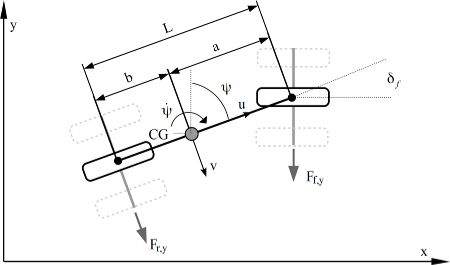

# Bicycle

## Overview
This pilot study is an example of a vehicle driving a route defined from a set of way points. The multi-model consist of a steering controller and a model representing the dynamics of a vehicle. The steering controller contains the desired route of the vehicle. The vehicle is steered on the front wheels.

## Supported Features
This study supports the following INTO-CPS technologies:

* 20-Sim (for FMU)
* VDM-RT (for FMU)
* INTO-CPS SysML  
* Co-simulation Engine (COE)
* Design Space Exploration

## Additional Information
For additional information contact the case study owner, [Frederik Foldager](mailto:ffo@agrointelli.com)
